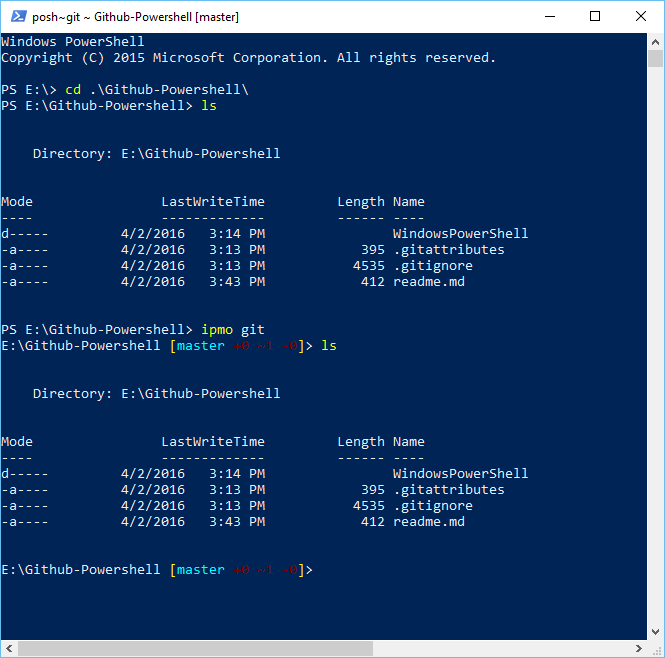

# Install
Folder WindownPowershell shold be under your powershell profile  
for me it's C:\user\mike\Documents\WindowsPowerShell  
copy modules once:
```powershell
git clone https://github.com/mbasiuk/Github-Powershell.git
copy .\WindowsPowerShell\Modules\ (Split-Path $PROFILE) -Recurse -ErrorAction Ignore
```

# Features

Tab completion
--------------

   Provides tab completion for common commands when using git.   
      
     git ch<tab> --> git checkout
     git checkout<tab> --> git checkout master
     git checkout master<tab> --> git checkout origin/HEAD
     git checkout origin/HEAD<tab> --> git checkout origin/master

The Prompt
----------

PowerShell generates its prompt by executing a `prompt` function, if one exists. git module defines such a function in `git.psm1` that outputs the current working directory followed by an abbreviated `git status`:

    C:\Users\Mbasiuk [master]>

By default, the status summary has the following format:

    [{HEAD-name} +A ~B -C !D | +E ~F -G !H !]

* `{HEAD-name}` is the current branch, or the SHA of a detached HEAD
 * Cyan means the branch matches its remote
 * Green means the branch is ahead of its remote (green light to push)
 * Red means the branch is behind its remote
 * Yellow means the branch is both ahead of and behind its remote
* ABCD represent the index; EFGH represent the working directory
 * `+` = Added files
 * `~` = Modified files
 * `-` = Removed files`
 * `!` = Conflicted files
 * As in `git status`, index status is dark green and working directory status is dark red
 * The trailing `!` means there are untracked files

For example, a status of `[master +0 ~2 -1 | +1 ~1 -0]` corresponds to the following `git status`:

    # On branch master
    #
    # Changes to be committed:
    #   (use "git reset HEAD <file>..." to unstage)
    #
    #        modified:   this-changed.txt
    #        modified:   this-too.txt
    #        deleted:    gone.ps1
    #
    # Changed but not updated:
    #   (use "git add <file>..." to update what will be committed)
    #   (use "git checkout -- <file>..." to discard changes in working directory)
    #
    #        modified:   not-staged.ps1
    #
    # Untracked files:
    #   (use "git add <file>..." to include in what will be committed)
    #
    #        new.file

This Powershell Module Advantage
--------------------------------

* `Powershell Module` is better than `Powershell Profile`
 * No break your context - `Git Shell.lnk` may ask for `GitHub` update and be very annoing with this.   
 * This loaded in `powershell` - this is important, becouse as the middle of your session with chosen path, acount (admin or user),
 inited variables that you calculated etc... you need git. You can close your session and start `Git Shell.lnk`.
 * `Import-Module` have native alias `ipmo`
 * `ipmo` support tab completion in `powershell` for all molules, just use `ipmo g<tab>` --> `ipmo git` 
 * without separete `Git Shell` instance
 * without editing enviroment variables
 * `git` in your `PATH` is not required
 * editing `powershell profile` is not required
 * easy to run `Git Shell` as administrator, (impossible using `Git Shell.lnk`)
 * no dependency on `Magic GitUub Guids` in the path like `PortableGit_25d850739bc178b2eb13c3e2a9faafea2f9143c0` or
`PoshGit_869d4c5159797755bc04749db47b166136e59132`. This `Magic Guids` updated after every `GitHub` update
 * no need to type long path for git dir
 * editing `powershell profile` is not recommended. In case if we add `posh-git` to `$PROFILE` it will eat about `500ms` on my laptop! for every powershell start!
 I prepare small test for `posh-git` init on my laptop:      

```powershell    
    PS E:\> Measure-Command { ipmo git }
    
    
    Days              : 0
    Hours             : 0
    Minutes           : 0
    Seconds           : 0
    Milliseconds      : 439
    Ticks             : 4397888
    TotalDays         : 5.09014814814815E-06
    TotalHours        : 0.000122163555555556
    TotalMinutes      : 0.00732981333333333
    TotalSeconds      : 0.4397888
    TotalMilliseconds : 439.7888
    
    PS E:\> $computerSystem = Get-CimInstance CIM_ComputerSystem
    PS E:\> $computerBIOS = Get-CimInstance CIM_BIOSElement
    PS E:\> $computerOS = Get-CimInstance CIM_OperatingSystem
    PS E:\> $computerCPU = Get-CimInstance CIM_Processor
    PS E:\> $computerCPU | fl


    Caption           : Intel64 Family 6 Model 69 Stepping 1
    DeviceID          : CPU0
    Manufacturer      : GenuineIntel
    MaxClockSpeed     : 2601
    Name              : Intel(R) Core(TM) i7-4510U CPU @ 2.00GHz
    SocketDesignation : SOCKET 0
    
    PS E:\>  Get-WmiObject win32_diskdrive | where { $_.model -match ‘SSD’}


    Partitions : 5
    DeviceID   : \\.\PHYSICALDRIVE0
    Model      : Samsung SSD 850 EVO 500GB
    Size       : 500105249280
    Caption    : Samsung SSD 850 EVO 500GB
    
    PS E:\> $computerOS | select -Property Caption, OSArchitecture, Manufacturer, Debug, Version


    Caption        : Microsoft Windows 10 Home
    OSArchitecture : 64-bit
    Manufacturer   : Microsoft Corporation
    Debug          : False
    Version        : 10.0.10586
    
    PS E:\> $computerSystem | select -Property SystemType, Manufacturer, Model

    SystemType   Manufacturer          Model
    ----------   ------------          -----
    x64-based PC ASUSTeK COMPUTER INC. Q551LN
```    
     

# Usage

open powershell   
type:

```powershell
ipmo git
```

Now you can use 
* tab expansion for git commands, 
* highlight
* push/sync
* and many others

# Demo

*just see on same before* impo git *and after*


